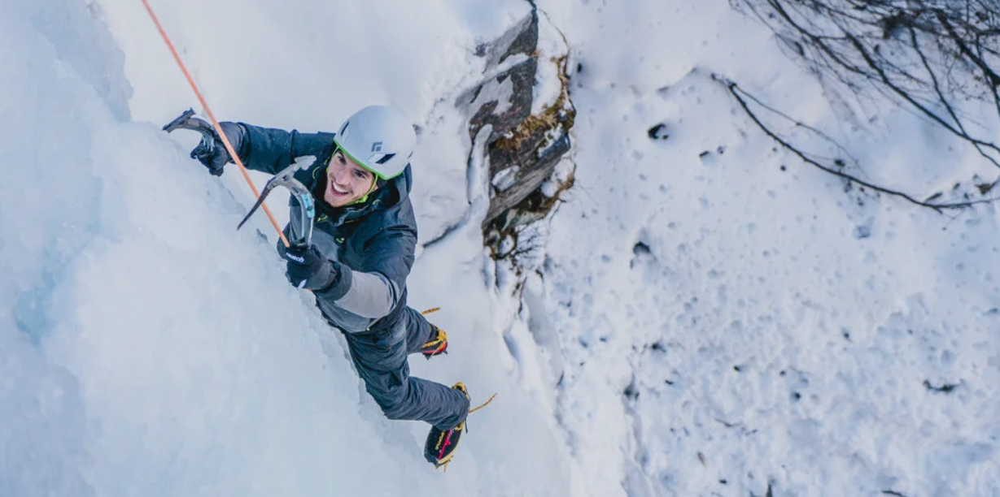

# Escalada de Gelo em Cogne

## Participação no Festival de Cogne

O Festival Cogne (Ice Openning Cogne) marca o início da abertura da escalada em Gelo na Região do Vale de D'Aosta em Itália. 

A escola de Montanha quer levar um grupo de participante a participar no festival para usufruir da Beleza do local e aprimorar os conhecimentos dos participante na Escalada em Gelo. 

Se tiver interesse em participar no evento envie e-mail para pedir mais informações

[Informações e Programa](https://www.cogneiceopening.net/program2026?fbclid=PAdGRzdgT45DhwZG9mAmV4dG4DYWVtAjExAHNydGMGYXBwX2lkDzU2NzA2NzM0MzM1MjQyNwABp1kOE7F5nibB36HhjGJOb82GoSTdWmO27iZenMrV6ZHdVexHO2equBV_Bz8s_aem_yil41PktPeCEQk_AjmTFaQ)

