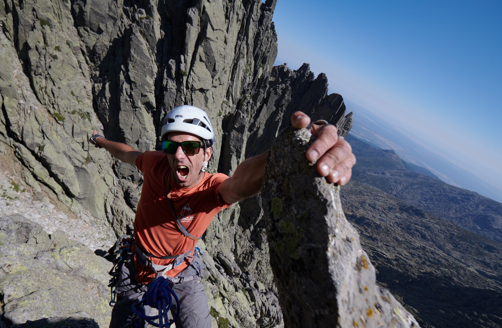

## Estágio de Escalada e Montanhismo nos Galayos
## Projeto GRANDES PAREDES
# Galayos 2026
### Estágio de escalada clássica

##### **Introdução:**
Este projeto consiste no acompanhamento de um grupo ao longo de diversas atividades, tendo em vista um estágio final nos Galayos, de modo a que os participantes cheguem a esta atividade com:

- Mais treino técnico e físico
- Melhor conhecimento do grupo
- Noção das suas capacidades e limitações
- Mais confiança para os desafios a enfrentar

O projeto será liderado pelo técnico *JP Lopes* que irá acompanhar o grupo de inscritos ao longo de vários meses até à realização da atividade final prevista para os dias *3 a 6 de outubro*.  
Esse acompanhamento será feito em atividades a combinar entre o técnico e os participantes em diferentes locais, com diferentes temas. 
 Não sendo de carácter obrigatório, são altamente recomendadas e será estipulado um mínimo de participações para poder participar no estágio final.

##### **Data:**
- Fase preparatória: diversas atividades em datas a propor pelo técnico e participantes
- Fase final: ? + 1 sessão preparatória online

##### **Técnicos:**
- João Paulo Ferrão, Eduardo Ventura e Nelson Cunha.

##### **Público alvo:**
- Praticantes de escalada autónomos:
    - Podem liderar largos de auto-proteção ou apenas escalar de segundo
    - Tem que ser autónomos em escalada de desportiva e ter experiência em escalada de multilargos (vias equipadas ou de autoproteção).
    
##### **Objetivos:** 
- Preparar um grupo de praticantes para escalada de grandes paredes
- Melhorar competências técnicas de segurança e progressão em escalada clássica
- Realizar uma atividade final com níveis elevados de competência e confiança

##### **Condições de participação:**
- Inscrição prévia no projeto, com intenção e compromisso de participar na fase final
- Pagamento adiantado de uma parte do valor da atividade final(50%).
- Participação em atividades a marcar com os técnicos envolvidos, pagas ao dia(30€).
- Não poderá participar na fase final sem um mínimo de 2 atividades de treino prévio
- Reserva-se aos técnicos o direito de não recomendar a participação na fase final do projeto
- O pré-inscrito não se vê obrigado a participar na fase final.

### Custos 

##### **Treinos de Preparação:**
- **30€/dia** sócios
- **45€/dia** não sócios

##### **Fase Final:**
- **125€** associados autónomos na prática de escalada clássica
(capazes de liderar uma cordada)
- **250€** Associados AEM, praticantes de escalada clássica, não autónomos
(habituados a escalar em segundo de cordada)
- **375€** para não associados (autónomos ou não)

*na adesão ao projeto, pagam com 50% deste valor, reembolsável (25%)
em caso de não participar na atividade final.*

> 
Inclui: enquadramento da atividade, equipamento coletivo e reportagem fotográfica. 
> Viagem, refeições e alojamento são da responsabilidade do participante. 
> Possibilidade de dormida e refeições em refúgio ou bivacar e cozinhar. 
> Aproximação de cerca de 6km com muito desnível que pode demorar até 3h.

##### **Equipamento individual necessário:**
- Roupa desportiva e calçado robusto para caminhar
- Reforço alimentar para meio da manhã, lanches e outras pausas
- Mochila média (20 a 30L) para transportar equipamento e alimentos.
- EPI de escalada:
    - arnês e capacete, 
    - pés de gato, 
    - saco de magnésio, 
- 1 dispositivo de segurança, 
- 3 mosquetões
- 1 anel de fita e 1 cordelete.

Em regime facultativo, disponibilizamos a aluguer de equipamento individual, pelo valor total de 25€ ou 5€ por equipamento necessário, pagos no dia ao formador.

#### Inscrições 

[INSCRIÇÃO](https://docs.google.com/forms/d/e/1FAIpQLSelXCNTYBeTeoKgx9tc_A23BrDfwuzNpNhByjM3i102VbNctg/viewform?usp=header)

#### Pagamento
Por transferência bancária: **IBAN:PT50 0033 0000 45589654875 05**

MBWAY: **911 843 936** 