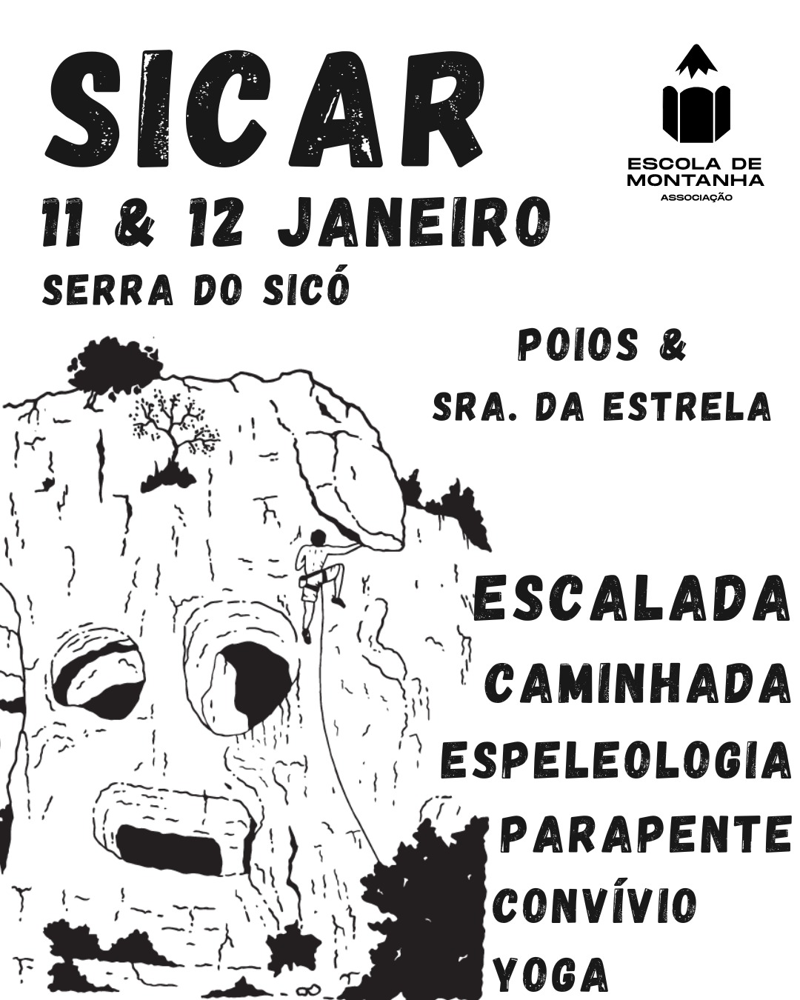

Encontro de abertura de atividades para a temporada que se segue! Na Serra de Sicó buscamos o sol do Inverno, as paredes de escalada, os trilhos para caminhar, as grutas e até as descolagens de parapente. Mas, acima de de tudo, procuramos o convívio e a partilha num cenário de extraordinária beleza natural.

[Inscrições](https://docs.google.com/forms/d/e/1FAIpQLSds8Hl6DbaTcgCyVsTBwAjz0Pl_xoklj8YZ0eF2atrR8y2icA/viewform)

### Programa:

#### Sábado:
- 9h - Secretariado
- 10h - Início de atividades
- Prática autónoma de escalada
- Batismo de Espeleologia (mínimo de 6 e máximo de 12 participantes)
- Batismo de Parapente (horário e local a combinar com os pilotos)
- Aula de Ioga, em local a combinar
- 18h - Partilha gastronómica (cada um traz e partilha)

Domingo:
9h Secretariado
10h Início de atividades
Prática autónoma da escalada
Oficina de treino de quedas em escalada (mínimo 2 e máximo 8 participantes)
Caminhada guiada no Vale de Poios
Aula de Ioga, em local a combinar
Batismo de Parapente (horário e local a combinar com os pilotos)
17h Encerramento

Valores de inscrição diários:
15€ não associados
10€ associados e membros de entidade com protocolo
5€ associados e membros de entidade com protocolo com seguro desportivo ativo
15€ extra para batismo de espeleologia
15€ extra para oficina de quedas
60€ extra para batismo de parapente (pago no dia aos Pilotos)

Inclui: momento de partilha gastronómica, possibilidade de pernoita em regime de acantonamento, seguro, enquadramento e equipamento nas atividades enquadradas.

Não inclui refeições.

Observações
A realização do batismo de parapente fica dependente de condições meteorológicas para realizar, sendo que o local e horário será combinado, no dia, com os pilotos. Será pago diretamente aos mesmos e pode inviabilizar a participação em alguma das outras atividades programas.
A oficina de treino de quedas não é compatível com a caminhada guiada. 