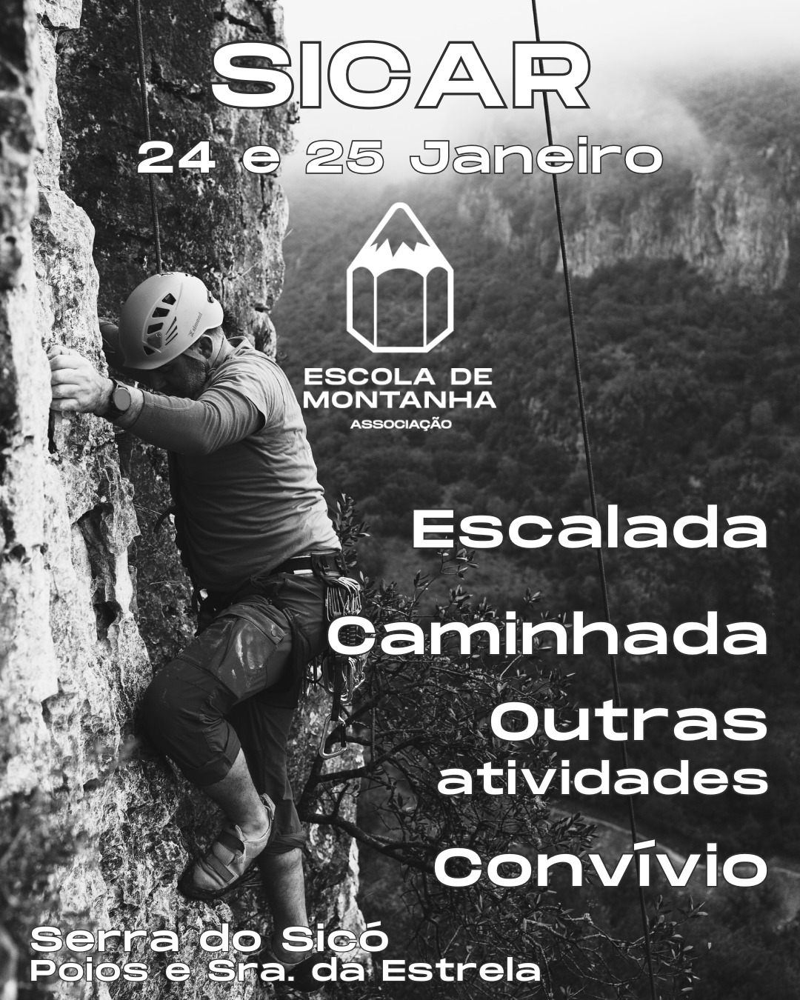

Encontro de abertura de atividades para a temporada que se segue! Na Serra de Sicó buscamos o sol do Inverno, as paredes de escalada, os trilhos para caminhar. Mas, acima de de tudo, procuramos o convívio e a partilha num cenário de extraordinária beleza natural.

[Inscrições](https://docs.google.com/forms/d/1N_9-E6uQF1uXcZ0-oHD4s7GZFS5ys0dcPbbCUSrvghA/viewform?fbclid=PAZXh0bgNhZW0CMTEAc3J0YwZhcHBfaWQMMjU2MjgxMDQwNTU4AAGntYMhfmiCjBlV-WgBiMgSwowlERUTT194UdT4M2jgtIk-sp41OdFUE8n5L8k_aem_kEGyMC6fIzAZZJc-xQVAyQ&edit_requested=true)

### Programa:

#### Sábado:
- 9h - Secretariado.
- 10h Início de atividades:
  - Prática de escalada: Autónomos e Iniciados.
  - Caminhada guiada no Vale de Poios.
- 17h - Aula de Ioga, em local a combinar.
- 18h - Partilha gastronómica (cada um traz e partilha).

#### Domingo:
- 8h - Aula de Ioga.
- 9h - Secretariado.
- 9h30m  Início de atividades:
  - Prática de escalada: Autónomos e Iniciados.
  - Experiencia de Escalada (máximo 6 participantes) dois turnos: 9h30-12h30 e 14h-17h.
  - Caminhada guiada nas Buracas do Casmilo.
- 17h Encerramento

**Valores de inscrição diários**:
- 16€ não associados.
- 11€ associados s/seguro desportivo e membros de entidade com protocolo.
- 5€ associados com seguro desportivo ativo.

Inclui: momento de partilha gastronómica, possibilidade de pernoita em regime de acantonamento, enquadramento e equipamento nas atividades enquadradas.

*Não inclui refeições.*
