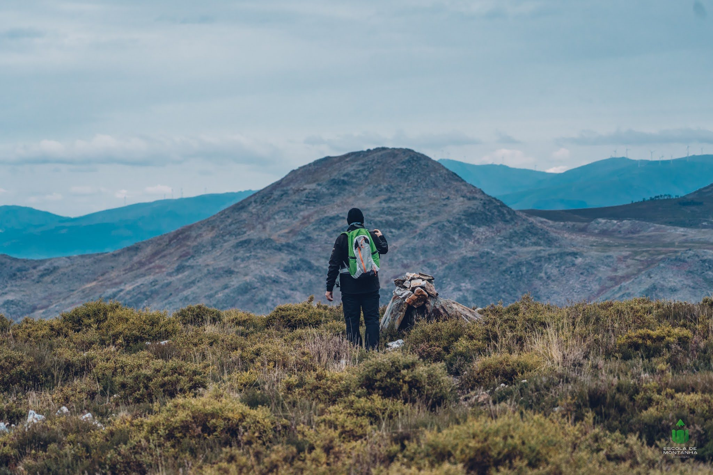

# Montanhismo

Prática que consiste na exploração e conquista de montanhas, abrangendo desde o pedestrianismo — caminhadas acessíveis em contacto direto com a natureza — até o alpinismo, que envolve a ascensão de montanhas de maior altitude com recurso a técnicas avançadas de progressão e segurança em neve, gelo e rocha. É uma atividade que combina esforço físico, espírito de equipa, autonomia e um profundo respeito pelos riscos das grandes paisagens naturais.

## Cursos de Montanhismo 

**PRATICANTE**

|**Nível**|**Descrição**| 
|-----|--------------------------|
|**1**| **Iniciação** |
|**2**|**Autonomia**|

**TÉCNICO**

|**Nível**|**Descrição**| 
|-----|--------------------------|
|**1**| **[Guia de Percursos Pedestres](https://escolademontanha.com/eventos/tecnico1-montanha/)** |

