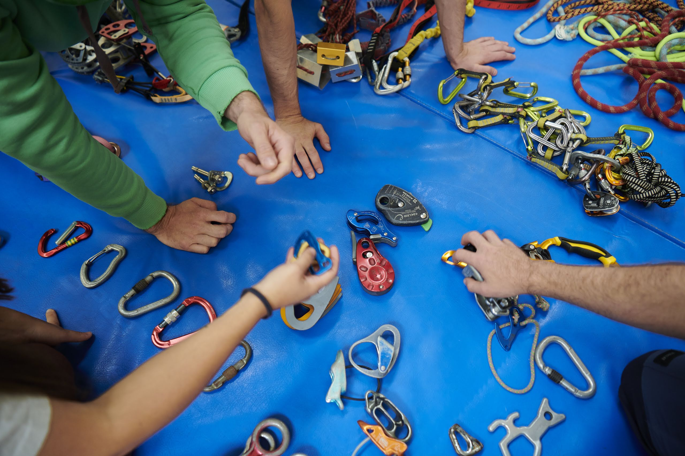

A **“Escola de Montanha”** é uma associação que tem como fim a Formação Desportiva,
Formação Profissional, Treino Desportivo, Organização de Atividades Desportivas,
Organização de Eventos, Educação ambiental, Informação Turística, Animação Turística,
Publicações e Investigação Científica.

 ## A Associação Escola de Montanha pretende:
 
a) Promover boas práticas de segurança em atividades desportivas de montanha,
com foco prioritário na caminhada, montanhismo, alpinismo, todas as formas de
escalada e canyoning, tendo abertura para outras atividades desportivas de montanha,
tais como corridas de montanha, trail, orientação, canoagem, parapente, rafting, BTT,
espeleologia, entre outras.

b) Formar praticantes e técnicos das atividades desportivas de montanha
anteriormente referidas.

c) Promover atividades de iniciação, prática e treino de aperfeiçoamento para os
seus associados.

d) Dinamizar áreas de formação de carácter não desportivo, tais como primeiros
socorros, educação ambiental, percursos interpretados de natureza, campos de férias,
entre outras.

e) Organizar eventos lúdicos e competitivos, abertos à comunidade, com o fim da
divulgação e promoção das atividades que desenvolve.

f) Preparar e apoiar associados para participação em eventos e competições.

g) Fazer publicações de modo a difundir informação sobre cuidados de segurança
em montanha, preservação de património natural e promoção de boas práticas
ambientais, desenvolvendo, se necessário, projetos editoriais.

h) Associar-se, filiar-se ou colaborar com associações congéneres e outras
entidades municipais, de ensino e federativas, com objetivos e estratégias comuns.

i) Cooperar com entidades locais, nacionais e internacionais para a prossecução
dos fins da associação.

