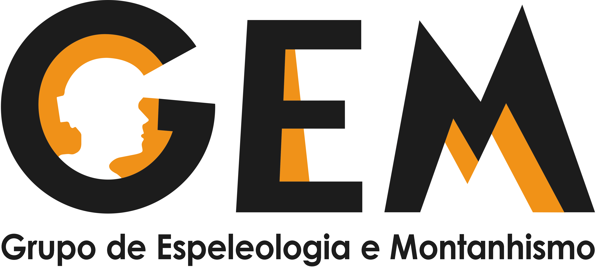
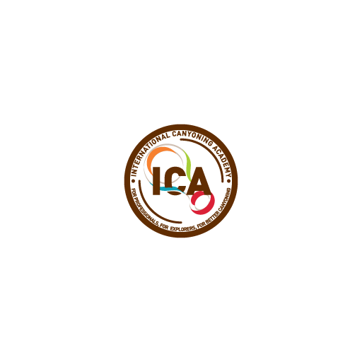
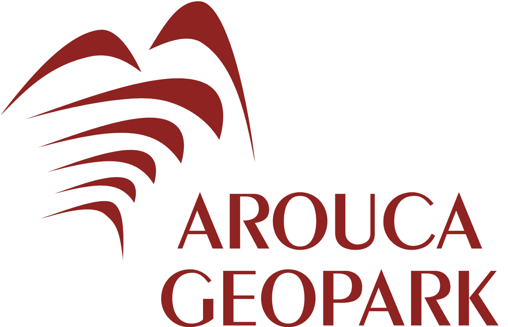
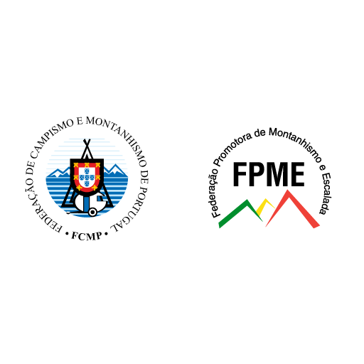

# PARCERIAS 

## 
[Clube de Montanhismo da Guarda](https://www.montanhismo-guarda.pt/portal/)

[Espeleo Club Descenso de Cañones - Portugal](http://ecdcportugal.com/)

[Grupo de Espeleologia e Montanhismo](https://gem.pt/1/)

[Gomes & Canoso](https://gomesecanoso.pt/)

[International Canyoning Academy](https://www.ica-canyoning.org/pt/)

[Nucelo de Montanha de Espinho](https://montanha.org/)

[Safe](https://safe-climbing.org/home/)

[Zone Climb](https://zone.com.pt/climb/)

# FILIAÇÕES

[Arouca Geopark](https://aroucageopark.pt/)

[Municipio de Arouca](https://www.cm-arouca.pt/)

[Federação de Campismo e Montanhismo de Portugal](https://www.fcmportugal.com/)

[Federação Portuguesa de Escalada de Competição](https://www.fpme.org/webpu/)

